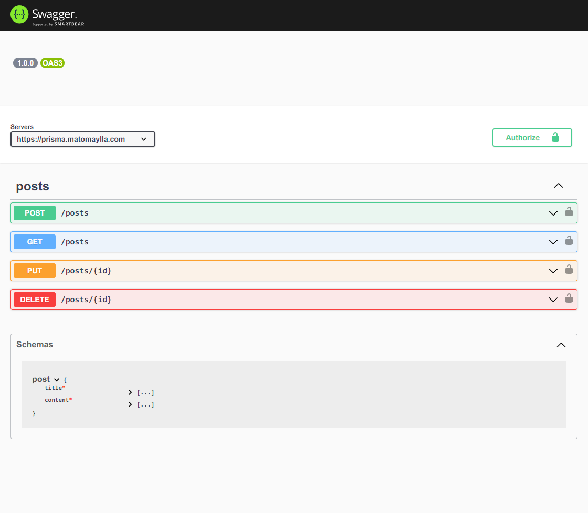

# Prisma API - code component solution

This is a simple REST API CRUD about table POST, using Prisma ORM integrates seamlessly with PlanetScale.  

## Table of contents

- [Overview](#overview)
  - [Screenshot](#screenshot)
  - [Links](#links)
- [My process](#my-process)
  - [Built with](#built-with)
  - [Installation](#installation)
- [Author](#author)


## Overview

### Screenshot



### Links

- Solution URL: [https://github.com/darkmtrance/prisma-api](https://github.com/darkmtrance/prisma-api)
- Live Site URL: [https://prisma.matomaylla.com/docs/](https://prisma.matomaylla.com/docs/)

## My process

### Built with

- [Prisma] (https://www.prisma.io/) - ORM
- [Planetscale] (https://planetscale.com/) - MySQL Database
- [Swagger] (https://swagger.io/) - API docs
- [Supertest] (https://www.npmjs.com/package/supertest) - Test
- [Jest] (https://jestjs.io/) = Test
- [Express](https://expressjs.com/) - Node.js web application framework

### Installation

```bash
git clone https://github.com/darkmtrance/prisma-api.git
cd prisma-api
npm install
```

create file .env with the next info:
```bash
DATABASE_URL=${DATABASE_URL}
SHADOW_DATABASE_URL=${SHADOW_DATABASE_URL}
```
change the values `${DATABASE_URL}` and `${SHADOW_DATABASE_URL}` with planescale conections string.

run app

```bash
npx prisma generate
npm start
```

run test

```bash
npm test
```

## Author

- Website - [Michael Tomaylla](https://cv.matomaylla.com/)
- Linkedin - [@matomaylla](https://www.linkedin.com/in/mtm2019/)
